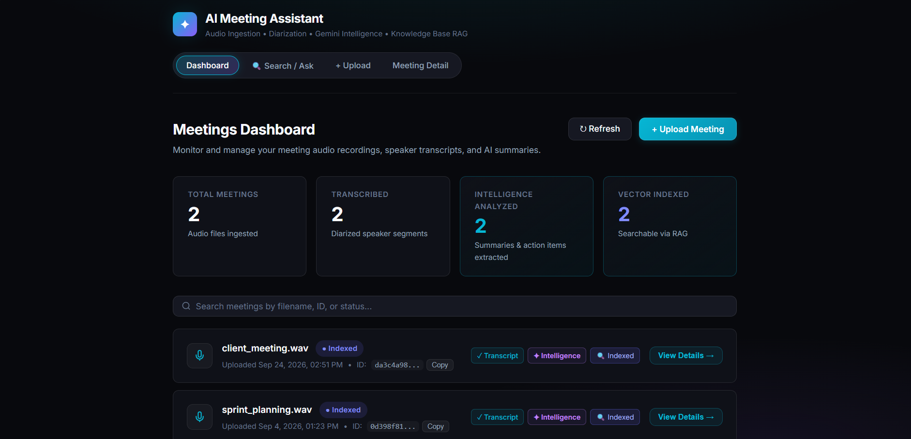

# MeetingIQ — AI Meeting Assistant

An end-to-end AI system that converts meeting recordings into structured,
searchable business information: speaker-attributed transcripts,
executive summaries, decisions, action items, and natural-language
question-answering over past meetings.

Built as an engineering-focused exploration of how modern AI meeting
intelligence platforms (Otter.ai, Fireflies.ai, Zoom AI Companion) work
under the hood — real pipeline design, evaluation, and production
engineering practices, not just an LLM demo.



---

## What it does

- Upload a meeting recording (audio or video)
- Automatically transcribe it with speaker separation (who said what)
- Generate an executive summary, key discussion points, and decisions
- Extract action items with assignees and deadlines
- Ask natural-language questions across all past meetings and get
  grounded answers with source references
- Export any meeting as a downloadable PDF or Word report

---

## Architecture

```
Audio/Video Upload
        ↓
Speech-to-Text (Whisper)
        ↓
Speaker Diarization (pyannote.audio)
        ↓
Speaker-attributed Transcript
        ↓
Meeting Intelligence (Gemini — single structured LLM call)
   ├── Summary
   ├── Key Discussion Points
   ├── Decisions
   └── Action Items
        ↓
   PostgreSQL  +  Qdrant (vector DB)
        ↓
RAG-based Question Answering
        ↓
React UI  /  PDF & Word Export
```

Each pipeline stage is an independent, testable module — a failure in
one stage (e.g. diarization) can't take down another (e.g. upload).

---

## Tech stack

| Layer | Technology |
|---|---|
| Backend | Python, FastAPI, Pydantic, SQLAlchemy, Alembic |
| Frontend | React, Vite, TypeScript |
| Speech-to-text | OpenAI Whisper |
| Speaker diarization | pyannote.audio |
| LLM | Google Gemini (via LangChain) |
| Embeddings | Sentence Transformers |
| Vector database | Qdrant |
| Relational database | PostgreSQL |
| Containerization | Docker, Docker Compose |
| Testing | Pytest, pytest-asyncio |

Full details: [`docs/00_technology_stack.md`](docs/00_technology_stack.md)

---

## Project structure

```
AI-Meeting-Assistant/
├── backend/
│   └── app/
│       ├── api/ or routers/      # FastAPI endpoints
│       ├── core/                  # config, database setup
│       ├── models/                # SQLAlchemy models
│       ├── schemas/                # Pydantic schemas
│       ├── services/               # Whisper, diarization, Gemini, RAG logic
│       └── main.py
├── frontend/
│   └── src/                        # React application
├── data/
│   ├── raw_audio/                  # uploaded recordings (gitignored)
│   ├── transcripts/                 # generated transcripts (gitignored)
│   └── eval_dataset/                 # test recordings + known scripts
├── docs/
│   ├── 01_problem_definition.md
│   ├── 02_system_architecture.md
│   └── features/                     # one spec per feature
├── prompts/                           # LLM prompt templates
├── tests/                              # unit, integration, evaluation tests
├── docker-compose.yml
├── requirements.txt
└── AGENTS.md                           # engineering rules for AI coding agents
```

---

## Getting started

### Prerequisites
- Python 3.11+
- Node.js 20+
- Docker Desktop
- A Google AI API key (for Gemini)
- A Hugging Face account + access token (for pyannote diarization —
  requires accepting the model license on Hugging Face first)

### 1. Clone and configure
```bash
git clone https://github.com/Sasa0920/AI-Meeting-Assistant.git
cd AI-Meeting-Assistant
cp .env.example .env
# fill in DATABASE_URL, GOOGLE_API_KEY, HUGGINGFACE_TOKEN, etc.
```

### 2. Start infrastructure
```bash
docker compose up -d
```
This starts PostgreSQL and Qdrant.

### 3. Run the backend
```bash
cd backend
python -m venv assistant
./assistant/Scripts/Activate.ps1   # Windows
pip install -r requirements.txt
alembic upgrade head
uvicorn app.main:app --reload --port 8000
```

### 4. Run the frontend
```bash
cd frontend
npm install
npm run dev
```

### 5. Open the app
- UI: http://localhost:5173
- API docs (Swagger): http://localhost:8000/docs

---

## Features

| # | Feature | Status |
|---|---|---|
| 1 | Meeting upload & validation | ✅ |
| 2 | Transcription & speaker diarization | ✅ |
| 3 | Meeting intelligence (summary, decisions, action items) | ✅ |
| 4 | Knowledge base & RAG question-answering | ✅ |
| 5 | PDF/Word report export | ✅ |
| 6 | Web interface | ✅ |

Detailed specifications for each feature: [`docs/features/`](docs/features/)

---

## Evaluation

This project treats evaluation as a first-class engineering concern, not
an afterthought — each AI component is measured against defined success
metrics rather than judged by "it looks right":

| Component | Metric | Target |
|---|---|---|
| Transcription | Word Error Rate (WER) | > 90% accuracy |
| Action item extraction | Precision | > 80% |
| RAG question-answering | Correct answer rate | ~85–90% |
| Processing time | Relative to audio duration | < 2x |

Evaluation methodology and results: [`docs/03_experiments.md`](docs/03_experiments.md),
[`docs/04_evaluation_report.md`](docs/04_evaluation_report.md)

---

## Testing

```bash
# Run all tests
pytest tests/ -q

# Run tests for a specific feature
pytest tests/test_intelligence_api.py -v
```

Tests exist at three levels: unit (individual components), integration
(component interactions), and evaluation (AI output quality against
known test data).

---

## Engineering approach

This project was built with explicit engineering discipline rather than
ad-hoc prompting of an AI coding agent:

- **Specs before code** — every feature has a written specification in
  `docs/features/` before implementation began
- **AGENTS.md** — a project-specific rulebook (commands, conventions,
  security rules, dependency policy) that AI coding agents read and
  follow automatically
- **Plan-then-build workflow** — implementation plans were reviewed and
  approved before any code was written, for every feature
- **Verification over trust** — every feature was manually tested
  against real recordings before being considered complete, not just
  accepted on an agent's self-report

---

## Known limitations

- File-size limited to 2GB per upload
- Background processing uses FastAPI's built-in background tasks
  (not a persistent job queue) — a server restart mid-processing loses
  that job, with no automatic retry
- Local disk storage for audio files (would move to S3/Blob Storage for
  a production deployment)

---
