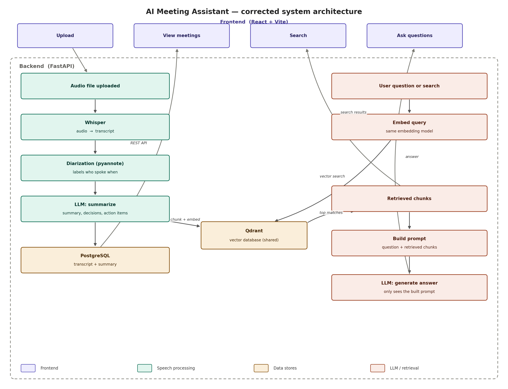

# System Architecture

## Input, Intermediate Outputs, and Final Outputs

  - Inputs - Meeting audio or video recordings(`.mp3`, `.wav`, `.m4a`, `.mp4`)
  - Outputs - Speech-to-Text Output, Speaker-Separated Transcript, Structured JSON Transcript, Semantic Chunks and Embeddings
  - Final outputs 
    * Executive meeting summary
    * Key discussion points
    * Decisions made during the meeting
    * Action-item list with assignees and deadlines
    * Searchable meeting knowledge base
    * Natural-language question-answering over historical meetings

    

## Features

AI Meeting Assistant will:

  * Upload meeting audio or video files.
  * Convert speech into accurate text transcripts using Whisper.
  * Identify and separate different speakers in the conversation.
  * Generate concise executive summaries of meetings.
  * Extract key discussion points automatically.
  * Detect important decisions made during the meeting.
  * Extract action items, assignees, and deadlines.
  * Store transcripts and summaries in a database.
  * Create semantic embeddings for meeting content.
  * Support RAG-based question answering over previous meetings.
  * Allow users to search historical meetings using natural language queries.
  * Generate downloadable PDF/Word meeting reports.
  * Log and monitor AI system performance and errors.
  * Provide a web-based interface for uploading, viewing, searching, and managing meetings.
